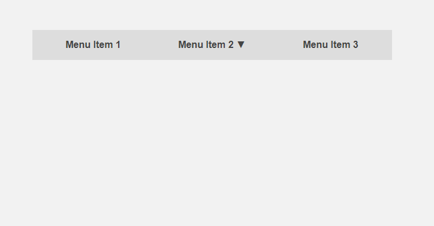

# predictive-ui [](https://travis-ci.org/prozoroff/predictive-ui)
Predictive behavior for html elements

| Simple dropdown | Predictive dropdown |
|:-:|:-:|
|   |  |

### Usage

As usual HTML boolean attribute

```html
<button predictive-item>Predictve button</button>
```
